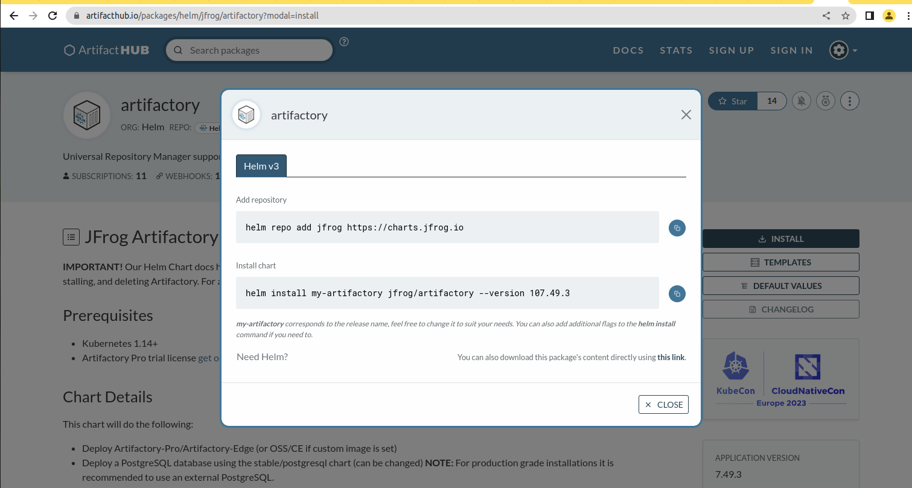
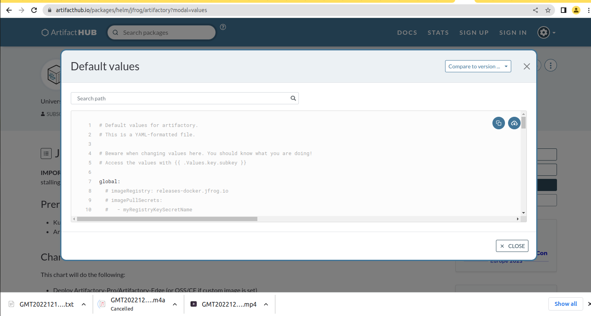
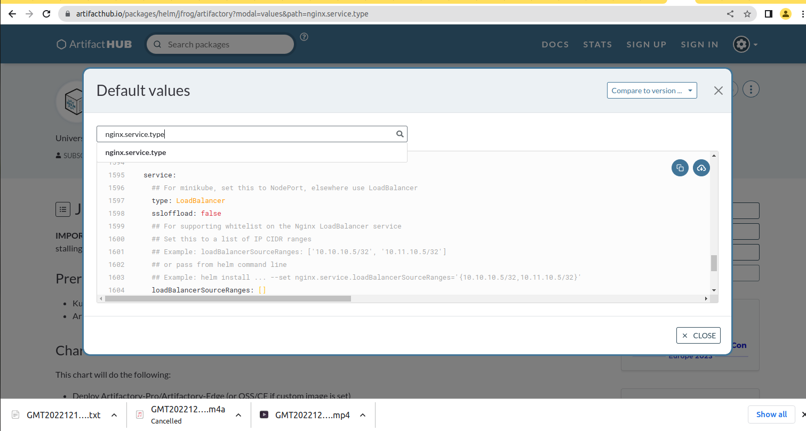

## DEPLOYING AND PACKAGING APPLICATIONS INTO KUBERNETES WITH HELM ##

We will be deploying these applications on our Kubernetes cluster in this project
- Artifactory
- Hashicorp Vault
- Prometheus
- Grafana
- Elasticsearch ELK using ECK

**Deploy Jfrog Artifactory into Kubernetes**

Artifactory is part of a suit of products from a company called Jfrog. Jfrog started out as an artifact repository where software binaries in different 
formats are stored. Today, Jfrog has transitioned from an artifact repository to a DevOps Platform that includes CI and CD capabilities. 
This has been achieved by offering more products in which Jfrog Artifactory is part of. Other offerings include

- JFrog Pipelines – a CI-CD product that works well with its Artifactory repository. Think of this product as an alternative to Jenkins.
- JFrog Xray – a security product that can be built-into various steps within a JFrog pipeline. Its job is to scan for security vulnerabilities in 
the stored artifacts. It is able to scan all dependent code.

In this project, the requirement is to use Jfrog Artifactory as a private registry for the organisation’s Docker images and Helm charts. 
This requirement will satisfy part of the company’s corporate security policies to never download artifacts directly from the public into production 
systems. We will eventually have a CI pipeline that initially pulls public docker images and helm charts from the internet, 
store in artifactory and scan the artifacts for security vulnerabilities before deploying into the corporate infrastructure. Any found 
vulnerabilities will immediately trigger an action to quarantine such artifacts.

1. Search for an official helm chart for Artifactory on [Artifact Hub](https://artifacthub.io/)

2. Review the Artifactory page

3. Artifactory helm installation instruction

4. Add the jfrog remote repository on your laptop/computer
~~~
helm repo add jfrog https://charts.jfrog.io
~~~

5. Create a namespace called tools where all the tools for DevOps will be deployed. (In previous project, you installed Jenkins in the default namespace. You should uninstall Jenkins there and install in the new namespace)
~~~
kubectl create ns tools
~~~

6. Update the helm repo index on your laptop/computer
~~~
helm repo update
~~~

7. Install artifactory
~~~
helm upgrade --install artifactory jfrog/artifactory --version 107.49.3 -n tools
~~~
**Output:**
~~~

~~~

**Getting the Artifactory URL**
  1. The artifactory helm chart comes bundled with the Artifactory software, a PostgreSQL database and an Nginx proxy which it uses to configure routes to the different capabilities of Artifactory. Getting the pods after some time, you should see something like the below.
  ~~~
  kubectl get pods -n tools
  ~~~
  **Output:**
  
  2. Each of the deployed application have their respective services. This is how you will be able to reach either of them.
  ~~~
  kubectl get svc -n tools
  ~~~
  **Output:**
  
  3. Notice that, the Nginx Proxy has been configured to use the service type of LoadBalancer. Therefore, to reach Artifactory, we will need to go through the Nginx proxy’s service. Which happens to be a load balancer created in the cloud provider. Run the kubectl command to retrieve the Load Balancer URL.
  ~~~
  kubectl get svc artifactory-artifactory-nginx -n tools
  ~~~
  **Output**
  
  4. Copy the loadbalancer URL and use on your browser
  
  
  5. Default username: **admin**, dafult password: **password**
  
  
**How the Nginx URL for Artifactory is configured in Kubernetes**
Helm uses the values.yaml file to set every single configuration that the chart has the capability to configure. THe best place to get started with an off the shelve chart from artifacthub.io is to get familiar with the **DEFAULT VALUES**
- click on the **DEFAULT VALUES** section on Artifact hub

- Search for **nginx.service** and select **nginx.service.type**

