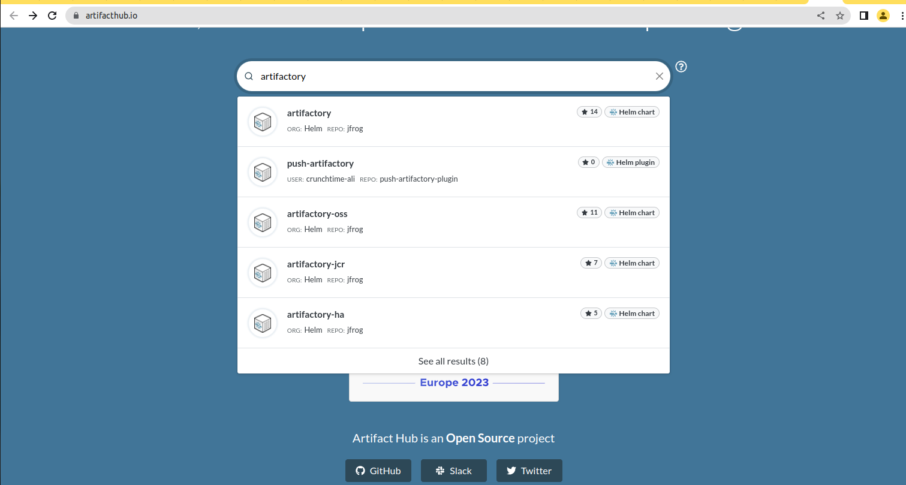
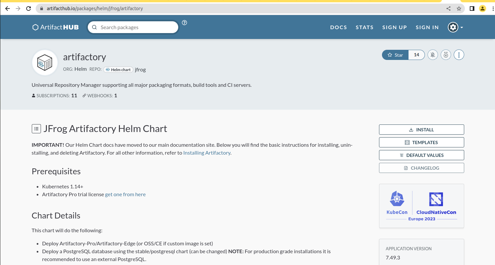

## DEPLOYING AND PACKAGING APPLICATIONS INTO KUBERNETES WITH HELM ##

We will be deploying these applications on our Kubernetes cluster in this project
- Artifactory
- Hashicorp Vault
- Prometheus
- Grafana
- Elasticsearch ELK using ECK

**Deploy Jfrog Artifactory into Kubernetes**

Artifactory is part of a suit of products from a company called Jfrog. Jfrog started out as an artifact repository where software binaries in different 
formats are stored. Today, Jfrog has transitioned from an artifact repository to a DevOps Platform that includes CI and CD capabilities. 
This has been achieved by offering more products in which Jfrog Artifactory is part of. Other offerings include

- JFrog Pipelines – a CI-CD product that works well with its Artifactory repository. Think of this product as an alternative to Jenkins.
- JFrog Xray – a security product that can be built-into various steps within a JFrog pipeline. Its job is to scan for security vulnerabilities in 
the stored artifacts. It is able to scan all dependent code.

In this project, the requirement is to use Jfrog Artifactory as a private registry for the organisation’s Docker images and Helm charts. 
This requirement will satisfy part of the company’s corporate security policies to never download artifacts directly from the public into production 
systems. We will eventually have a CI pipeline that initially pulls public docker images and helm charts from the internet, 
store in artifactory and scan the artifacts for security vulnerabilities before deploying into the corporate infrastructure. Any found 
vulnerabilities will immediately trigger an action to quarantine such artifacts.

1. Search for an official helm chart for Artifactory on [Artifact Hub](https://artifacthub.io/)

2. Review the Artifactory page

